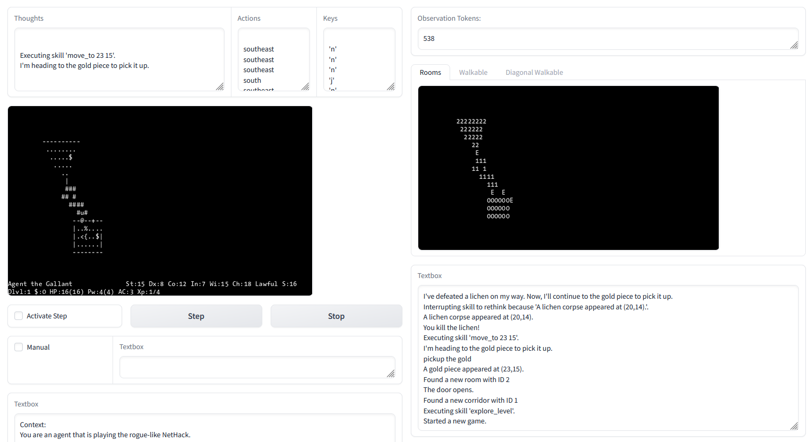

# NetPlay - A LLM powered agent for NetHack

## Installation
NetPlay was tested using VSCode, the devcontainer plugin, and Python 3.8.5. We recommend running NetPlay using the provided Dockerfile as it installs all the required dependencies. Alternatively, we provide a setup.py to install the project using pip. Note that some files, such as [run_scenarios.py](run_scenarios.py), use hardcoded paths and must be adapted if the project is installed in any other way.

```
git clone https://github.com/CommanderCero/NetPlay
cd netplay
pip install -e .
```

Netplay requires the environment variable OPENAI_API_KEY to be set to a valid key for the [OpenAI API](https://openai.com/blog/openai-api). Using the devcontainer plugin, this can be done by adding a devcontainer.env file to the .devcontainer folder. **Other LLMs** can be used by modifying the [run.py](run.py). However, we had no success when using any LLM besides GPT-4. If you manage to get it to work, let us know!


## Interactive


## Full Runs

## Scenarios

## Citation